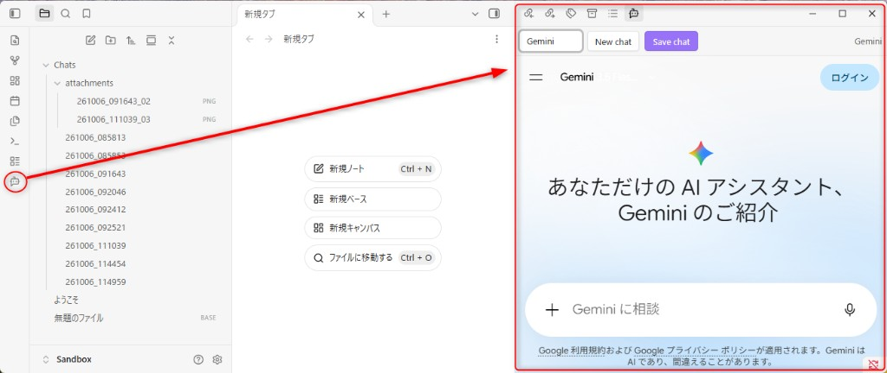
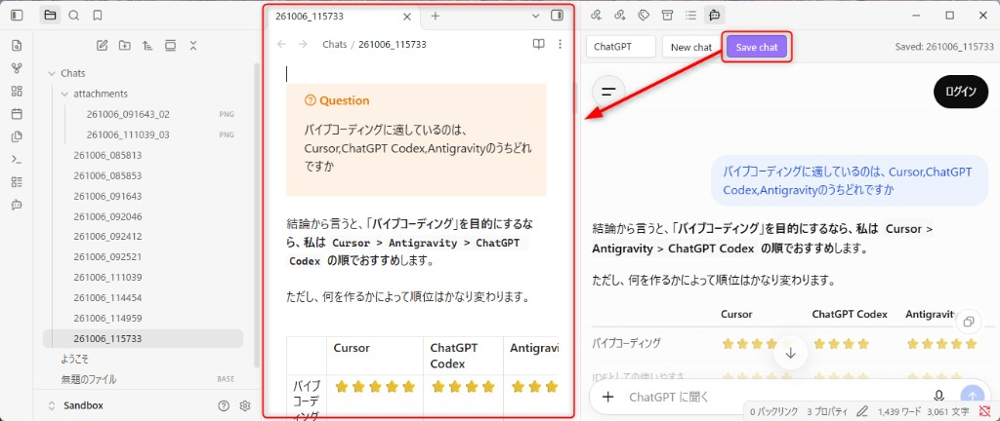

# ChatTaker

Saves your ChatGPT and Gemini conversation history to your vault.

Desktop Obsidian only (`isDesktopOnly`).

---

## 日本語

ChatGPT、Gemini に質問した内容と回答を記録するための、質素なプラグインです。  
Cursor を使用してバイブコーディングで作成しました。

1. 有効にすると Left Ribbon にボタンが現れ、ボタンを押すと Right Sidebar に ChatGPT / Gemini が表示されます。



2. プロンプトに入力して回答を記録したいとき、保存ボタンを押してください。あなたが指定したフォルダ、ファイル名で保存されます。



このプラグインが、あなたの発想を記録して整理する助けになることを期待しています。

### 制限事項

- ChatGPT、Gemini は常に非ログイン状態で開きます。
- これは主に ChatGPT ですが、ログイン時には一時チャットでも会話履歴を読み込み、回答内容に影響を及ぼしています。この「エコーチャンバー」を回避するための、意図的な仕様です。
- URL 等は自動的に変換されますが、一部表示（動的な地図、特殊リンク等）は正常に保存されないことを留意してください。
- ChatGPT、Gemini の仕様が変更した場合、予期せぬ不具合が発生する可能性があります。

---

## English

This is a simple plugin for recording the questions you ask ChatGPT and Gemini, along with their responses.  
I created it using Cursor and Vibe Coding.

1. When enabled, a button appears on the Left Ribbon; clicking it displays ChatGPT and Gemini in the Right Sidebar.


2. When you enter a prompt and want to save the response, click the Save button. It will be saved in the folder and with the filename you specify.


I hope this plugin helps you record and organize your ideas.

### Limitations

- ChatGPT and Gemini always open in an unlogged-in state.
- This applies primarily to ChatGPT; when logged in, even in a temporary chat, it loads conversation history, which can influence the responses. This is an intentional design choice to avoid this “echo chamber” effect.
- While URLs and similar content are automatically converted, please note that some elements (such as dynamic maps and special links) may not be saved correctly.
- If the specifications of ChatGPT or Gemini change, unexpected issues may occur.

### Network use

- This plugin embeds [ChatGPT](https://chatgpt.com/) and [Gemini](https://gemini.google.com/) in an Obsidian webview and loads those sites over the network.
- It does not call ChatGPT or Gemini APIs, and it does not send telemetry to the plugin author.
- By design, sessions start logged out. If you choose to sign in inside the webview, login state is kept by Electron partitions in Obsidian’s user data (not in your vault notes).

### Settings (brief)

- **Save folder** — vault-relative path (default `Chats`)
- **Filename** — template such as `{{date:YYMMDD_HHmmss}}` (`.md` / `.pdf` is added from the save format)
- **Language** — plugin UI / saved-note labels (`en` / `ja`; extra languages via `i18n.yaml` in the plugin folder)
- **Citation debug** — optional `*.debug.json` sidecar for troubleshooting

Default strings ship inside `main.js`. To add or override languages, place `i18n.yaml` next to `main.js` in the plugin folder and reload the plugin.

### Build (developers)

See [docs/developer.md](docs/developer.md).

```powershell
npm install
npm run check
```

Place `main.js`, `manifest.json`, and `styles.css` in `.obsidian/plugins/chattaker/`.

## License

MIT — see [LICENSE](LICENSE).
